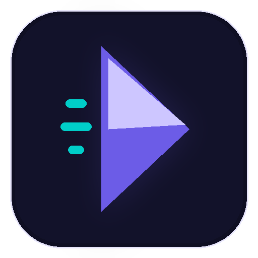

<p align="center">
  
</p>

<h3 align="center">Record locally. Turn the capture into a polished product demo.</h3>

<p align="center">
  Flowtake is a free, MIT-licensed desktop screen recorder and editor with automatic zoom and pan, cursor effects, a timeline, and local MP4 export.
</p>

<p align="center">
  <a href="https://github.com/JNX03/Flowtake/releases/latest"></a>
  <a href="https://github.com/JNX03/Flowtake/releases"></a>
  <a href="LICENSE"></a>
  
</p>

<p align="center">
  <a href="#60-second-quickstart">Quickstart</a> &bull;
  <a href="#download-and-platform-status">Downloads</a> &bull;
  <a href="#privacy-and-open-source-boundary">Privacy</a> &bull;
  <a href="#development">Development</a> &bull;
  <a href="CONTRIBUTING.md">Contributing</a>
</p>

---

## What Flowtake does

Flowtake keeps the recording workflow in one desktop app:

- Capture a full display, one window, or a custom area.
- Add camera, microphone, and supported system-audio sources.
- Generate zoom and pan motion from cursor activity, then tune it on the timeline.
- Trim and split clips; style cursor and click feedback; add masks, backgrounds, overlays, audio, and subtitles.
- Save projects locally and export finished videos as MP4 with FFmpeg.
- Experiment with separate app layers and scene layouts for multi-app technical demos.

The desktop recorder and editor are free to use, inspect, modify, and redistribute under the [MIT License](LICENSE).

## 60-second quickstart

On Windows 10 or 11, install the published package through WinGet:

```powershell
winget install --id JNX03.Flowtake -e --source winget
```

Or download the build for your OS from the [latest release](https://github.com/JNX03/Flowtake/releases/latest). On Windows, the `x64-setup.exe` is the simplest release asset.

Then:

1. Open Flowtake, choose **Record**, then select **Screen**, **Window**, or **Area**. Add a camera, microphone, or system-audio source if needed.
2. Start recording and use the compact recorder controls to pause or stop.
3. Open the saved project from **Library**, adjust the timeline and effects, then choose **Export** to render an MP4.

Your OS may ask for screen-recording, camera, or microphone permission on first use. Current platform-signing limitations can also produce a Windows SmartScreen or macOS Gatekeeper warning; see the status note below before proceeding.

## Download and platform status

Windows users can install v1.6.0 from the public WinGet catalog with `winget install --id JNX03.Flowtake -e --source winget`. All published artifacts and checksums remain available on the official [GitHub Releases page](https://github.com/JNX03/Flowtake/releases).

| Platform | Published artifacts | Current support boundary |
|---|---|---|
| **Windows 10/11 x64** | `.exe`, `.msi`, portable `.zip` | Primary development and validation target. FFmpeg is bundled. |
| **macOS 10.15+ Universal** | `.dmg`, portable `.zip` | Preview. Apple Silicon and Intel builds are published; expect rough edges and report reproducible issues. FFmpeg is bundled. |
| **Linux x64** | `.AppImage`, `.deb`, `.rpm`, portable `.tar.gz` | Preview. Screen capture requires X11 or XWayland; pure Wayland capture is not supported. The `.deb` and `.rpm` declare required system packages. |

> **Platform signing:** the current Windows artifacts are not Authenticode-signed. The macOS artifacts are ad-hoc signed, not signed with an Apple Developer ID, and not notarized. SmartScreen or Gatekeeper may warn. Download Flowtake only from this repository's release page, and do not bypass a warning for a copy obtained elsewhere.

## Product highlights

### Capture

- Full display, selected window, and custom-area recording
- Optional camera and microphone capture
- System-audio selection where the operating system exposes a compatible source
- Multi-monitor selection and recording quality controls
- Experimental separate app-layer capture for technical workflows

### Edit

- Automatic cursor-driven zoom and pan
- Timeline controls for clips, zooms, cursor styling, click effects, and drawn cursor paths
- Masks and blur for redaction
- Backgrounds, image/shape overlays, audio tracks, and subtitles
- Camera layout and background-blur controls
- Local project library with save and reopen support

### Export

- Local FFmpeg-based MP4 rendering
- Resolution, frame-rate, encoder, and bitrate controls
- Presets for common output profiles

## Privacy and open-source boundary

- Recordings, project files, and ordinary exports are stored locally. Flowtake does not include cloud project sync.
- The current Tauri build has Sentry disabled and no active product-analytics integration.
- Flowtake can make network requests for GitHub release checks. Explicit network features include YouTube upload and RTMP live streaming; some camera effects fetch model assets when used.
- Choosing a network feature sends data to the service you configure. Review that service's terms before connecting an account or stream destination.
- The desktop recorder/editor in this repository remains MIT licensed. Optional services do not revoke or paywall the existing open-source functionality.

For vulnerability reporting, follow the private process in [SECURITY.md](SECURITY.md).

## Optional: Release Studio

Teams that want human-assisted production for a technical launch can visit [Flowtake Release Studio](https://jnx03.github.io/Flowtake/). It is a separate, optional service; Flowtake's desktop recorder and editor remain the primary open-source product.

Maintainers planning their own release can use the free [six-beat developer-tool demo storyboard template](https://jnx03.github.io/Flowtake/developer-tool-demo-storyboard/) before recording. The guide includes a copyable brief, safe-capture exclusions, and a clearly labelled Flowtake v1.6.0 pre-production example.

Through July 23, 2026, Flowtake will publicly reply with a no-obligation six-beat storyboard to up to the first three maintainers who [share a complete, publicly documented developer-tool workflow](https://github.com/JNX03/Flowtake/discussions/169). No separate Flowtake signup, footage, or payment is required.

## Development

### Prerequisites

- [Node.js](https://nodejs.org/) 20+
- [Rust](https://www.rust-lang.org/tools/install) stable
- The [Tauri v2 system prerequisites](https://v2.tauri.app/start/prerequisites/) for your OS
- A target-named FFmpeg sidecar in `src-tauri/binaries/`

### Run locally

```bash
git clone https://github.com/JNX03/Flowtake.git
cd Flowtake
npm ci
```

Release artifacts bundle FFmpeg. For local native development, prepare the sidecar when it is absent:

```powershell
# Windows
powershell -ExecutionPolicy Bypass -File scripts/download-ffmpeg.ps1
```

```bash
# macOS or Linux
bash scripts/download-ffmpeg.sh
```

Then start the native app and frontend:

```bash
npm run dev
```

Useful checks:

```bash
npm test
npm run lint
npm run build:frontend
cargo check --manifest-path src-tauri/Cargo.toml --locked
```

### Architecture

Flowtake combines a [Tauri v2](https://v2.tauri.app/) Rust backend with a React 19 interface. Redux Toolkit manages editor state, PixiJS renders the preview and effects, Web Workers keep preview/render work off the UI thread, and FFmpeg handles capture and encoding.

The native app uses separate windows for the launcher/editor, recorder controls, exporter, source pickers, and annotations. Start with the [architecture docs](docs/architecture/README.md) or the [development guide](docs/getting-started/development.md) for a deeper tour.

## Contributing

Issues and pull requests are welcome. Please read [CONTRIBUTING.md](CONTRIBUTING.md) and the [Code of Conduct](CODE_OF_CONDUCT.md) before submitting a change.

The most useful reports include the operating system, Flowtake version, capture source, exact reproduction steps, and relevant logs. Linux reports should also say whether the session is X11, XWayland, or pure Wayland.

## License

Flowtake is licensed under the [MIT License](LICENSE).

---

<p align="center">
  Made with Rust, React, and a lot of screen recordings.
  <br>
  <sub>If Flowtake helps, a GitHub star or a reproducible bug report both move the project forward.</sub>
</p>
