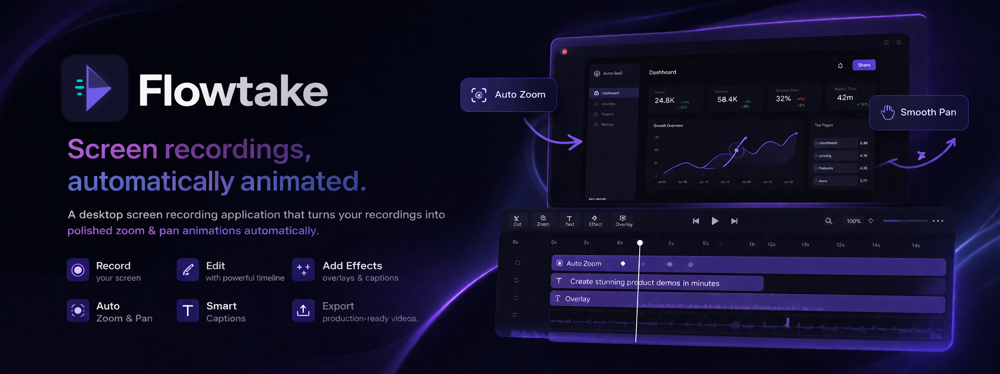
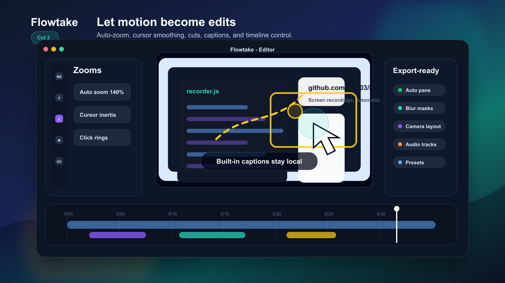

<p align="center">
  
</p>

<p align="center">
  <a href="#features">Features</a> &bull;
  <a href="#installation">Installation</a> &bull;
  <a href="#development">Development</a> &bull;
  <a href="CONTRIBUTING.md">Contributing</a> &bull;
  <a href="https://github.com/Jnx03/Flowtake/releases">Releases</a>
</p>

<p align="center">
  
  
  
  
  
  
  
</p>

---

Flowtake is a desktop screen recording application that automatically generates polished zoom and pan animations from your recordings. Record your screen, edit with a powerful timeline, add effects, overlays, captions, and export production-ready videos — all from one app.

<!-- Add screenshots to docs/screenshots/ and uncomment below -->
<!-- <p align="center">
  
  
</p> -->

## Features

### Recording
- **Screen Capture** — Record full screen, specific windows, or custom regions
- **Camera Overlay** — Picture-in-picture with configurable layouts (side-by-side, overlay, camera-only)
- **System Audio** — Capture system audio alongside microphone input
- **Multi-monitor** — Support for multi-display setups

### Editing
- **Auto-Zoom Animations** — Intelligent zoom effects that follow your cursor and focus areas
- **Pan Animations** — Smooth camera panning with velocity-based camera leading for natural follow
- **Cursor Inertia & Motion Blur** — Adaptive velocity-based cursor smoothing with motion blur scaled by speed
- **Timeline Zoom** — Ctrl+mousewheel zoom with granular grid spacing and fine-grained zoom steps
- **Smooth Playhead** — Refined playhead with larger drag handles and improved clip feedback
- **Click Indicators** — Animated visual feedback for mouse clicks
- **Custom Cursors** — Replace or style cursor appearance in recordings
- **Clips & Cuts** — Trim, split, and arrange video segments
- **Undo/Redo** — Full history support for all editing operations

### Effects & Overlays
- **Overlay Tracks** — Add images, shapes, and custom elements with animation
- **Audio Tracks** — Import and mix multiple audio tracks
- **Subtitles & Captions** — Built-in subtitle editor with speech recognition
- **Masks & Blur** — Redact sensitive areas with blur or solid masks
- **Backgrounds** — Custom backgrounds with wallpaper and blur effects
- **Intro/Outro** — Configurable zoom transitions for start and end

### Productivity
- **Teleprompter** — Built-in teleprompter with speech recognition sync
- **Presets** — Save and load recording/editing presets
- **Asset Library** — Predefined assets for quick overlay creation
- **Project System** — Save, load, and manage editing projects
- **Hotkeys** — Fully customizable keyboard shortcuts

### Export
- **FFmpeg Encoding** — Professional-grade video encoding
- **Multiple Formats** — Export to MP4, WebM, and more
- **Configurable Quality** — Choose encoder, resolution, and bitrate settings

## Architecture

Flowtake is built with a modern hybrid architecture combining a Rust backend with a React frontend.

```
+------------------------------------------------------------------+
|                        Flowtake Application                       |
+------------------------------------------------------------------+
|                                                                    |
|   +---------------------------+   +----------------------------+   |
|   |      Tauri v2 (Rust)      |   |     React 18 Frontend      |   |
|   |---------------------------|   |----------------------------|   |
|   | - Recording control       |   | - Editor workspace         |   |
|   | - FFmpeg sidecar mgmt     |   | - Timeline (zoom, pan,     |   |
|   | - Window/area picking     |   |   clicks, clips, masks,    |   |
|   | - File I/O & projects     |   |   subtitles, overlays,     |   |
|   | - Mouse tracking          |   |   audio tracks)            |   |
|   | - System integration      |   | - Properties panel         |   |
|   | - Video streaming         |   | - Preview player (Pixi.js) |   |
|   |   (video:// protocol)     |   | - Settings & presets       |   |
|   | - Export pipeline          |   | - Asset library            |   |
|   +---------------------------+   +----------------------------+   |
|                |                               |                   |
|                +---------- IPC Bridge ---------+                   |
|                       (Tauri Commands)                             |
|                                                                    |
+------------------------------------------------------------------+
|  Redux Toolkit (State)  |  Pixi.js (Render)  |  FFmpeg (Encode)  |
+------------------------------------------------------------------+
```

### Multi-Window Design

| Window | Purpose |
|--------|---------|
| **Main** | Launcher + full video editor with timeline |
| **Recorder** | Recording overlay and controls |
| **Exporter** | Render progress and export settings |
| **Window Picker** | Interactive window selection for capture |
| **Area Picker** | Custom region selection tool |
| **Note** | Annotation window (excluded from capture) |

### Tech Stack

| Layer | Technology |
|-------|-----------|
| **Desktop Framework** | [Tauri v2](https://v2.tauri.app/) (Rust) |
| **Frontend** | [React 18](https://react.dev/) + [Redux Toolkit](https://redux-toolkit.js.org/) |
| **Styling** | [TailwindCSS 4](https://tailwindcss.com/) + [DaisyUI 5](https://daisyui.com/) |
| **Graphics** | [Pixi.js 8](https://pixijs.com/) (2D animation rendering) |
| **Video Encoding** | [FFmpeg](https://ffmpeg.org/) (bundled sidecar) |
| **Build Tool** | [Vite 7](https://vite.dev/) |
| **AI/ML** | [MediaPipe](https://ai.google.dev/edge/mediapipe/solutions/guide) + [HuggingFace Transformers](https://huggingface.co/docs/transformers.js) |

## Installation

### Download

Download the latest installer from the [Releases](https://github.com/Jnx03/Flowtake/releases) page.

### Platform Support

| Platform | Status | Notes |
|----------|--------|-------|
| **Windows 10/11** (64-bit) | Stable | Primary supported platform |
| **macOS** 10.15+ | Developer preview | Bugs are frequent and some features may not work. Not recommended for production use. |
| **Linux** | Developer preview | Bugs are frequent and some features may not work. Not recommended for production use. |

> **macOS and Linux users:** These platforms are actively being worked on. Expect crashes and broken features. Stable support is planned for **v2.0.0**.

### System Requirements

- **RAM**: 4 GB minimum, 8 GB recommended
- **Storage**: ~200 MB for installation
- **GPU**: Hardware acceleration recommended for smooth preview

## Development

### Prerequisites

- [Node.js](https://nodejs.org/) 20+
- [Rust](https://www.rust-lang.org/tools/install) (stable toolchain)
- [Tauri v2 CLI](https://v2.tauri.app/start/prerequisites/)
- [FFmpeg](https://ffmpeg.org/) binary in `resources/`

### Setup

```bash
# Clone the repository
git clone https://github.com/Jnx03/Flowtake.git
cd Flowtake

# Install frontend dependencies
npm install

# Run in development mode (starts Tauri + Vite dev server)
npm run dev
```

### Available Scripts

| Command | Description |
|---------|-------------|
| `npm run dev` | Start Tauri dev server with hot reload |
| `npm run dev:frontend` | Start Vite frontend only (port 5173) |
| `npm run build` | Build production installer (NSIS/MSI) |
| `npm run build:frontend` | Build frontend assets only |
| `npm run lint` | Run ESLint on the codebase |

### Project Structure

```
Flowtake/
├── app/                     # React frontend
│   ├── shared/              # Code shared across all windows
│   │   ├── redux/           # Redux Toolkit store and slices
│   │   ├── scene/           # Pixi.js animation/rendering engine
│   │   ├── workers/         # Web Workers for preview and render
│   │   ├── tauriBridge.js   # IPC compatibility layer
│   │   ├── helpers.js       # Shared utility functions
│   │   └── constants.js     # App-wide constants
│   ├── components/          # Shared React UI components
│   └── windows/             # Per-window entry points
│       ├── main/            # Main editor window (100+ components)
│       ├── exporter/        # Export/render queue
│       ├── recorder/        # Recording overlay
│       ├── windowPicker/    # Window selection
│       ├── areaPicker/      # Area selection
│       └── note/            # Annotation window
│
├── src-tauri/               # Rust backend (Tauri v2)
│   ├── src/
│   │   ├── commands/        # IPC command handlers
│   │   ├── lib.rs           # App setup & video:// protocol
│   │   ├── state.rs         # Global application state
│   │   └── mouse_tracker.rs # System-wide mouse tracking
│   ├── Cargo.toml           # Rust dependencies
│   └── tauri.conf.json      # Tauri window & plugin config
│
├── resources/               # Bundled binaries (FFmpeg, AHK scripts)
├── docs/                    # Architecture and development docs
├── vite.config.mjs          # Vite build configuration
└── package.json             # NPM dependencies & scripts
```

For detailed documentation, see the [docs](docs/) directory or browse by topic:
- [Getting Started](docs/getting-started/installation.md)
- [Features Guide](docs/features/README.md)
- [Architecture](docs/architecture/README.md)
- [Development Setup](docs/getting-started/development.md)

## Contributing

We welcome contributions! Please read our [Contributing Guide](CONTRIBUTING.md) to get started.

Quick overview:
1. Fork the repository
2. Create a feature branch (`git checkout -b feature/your-feature`)
3. Commit your changes (`git commit -m 'feat: add your feature'`)
4. Push to your branch (`git push origin feature/your-feature`)
5. Open a Pull Request

Please also review our [Code of Conduct](CODE_OF_CONDUCT.md) before participating.

## Security

If you discover a security vulnerability, please follow our [Security Policy](SECURITY.md). Do **not** open a public issue for security vulnerabilities.

## Roadmap

- [ ] Linux stable support (targeting v2.0.0)
- [ ] macOS stable support (targeting v2.0.0)
- [ ] Plugin/extension system
- [ ] Cloud project storage
- [ ] Collaborative editing
- [ ] AI-powered auto-editing suggestions
- [x] Tutorial
- [x] Direct upload to YouTube/social platforms

## License

This project is licensed under the [MIT License](LICENSE).

## Acknowledgments

- [Tauri](https://tauri.app/) — Desktop framework
- [React](https://react.dev/) — UI library
- [Pixi.js](https://pixijs.com/) — 2D rendering engine
- [FFmpeg](https://ffmpeg.org/) — Video encoding
- [TailwindCSS](https://tailwindcss.com/) & [DaisyUI](https://daisyui.com/) — Styling
- [Redux Toolkit](https://redux-toolkit.js.org/) — State management

---

<p align="center">
  Made with Rust, React, and a lot of screen recordings.
</p>
