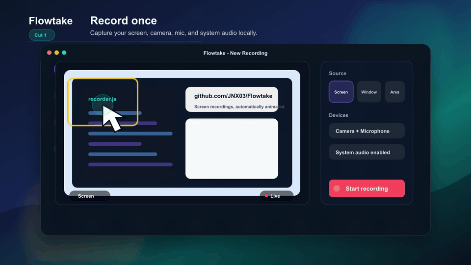
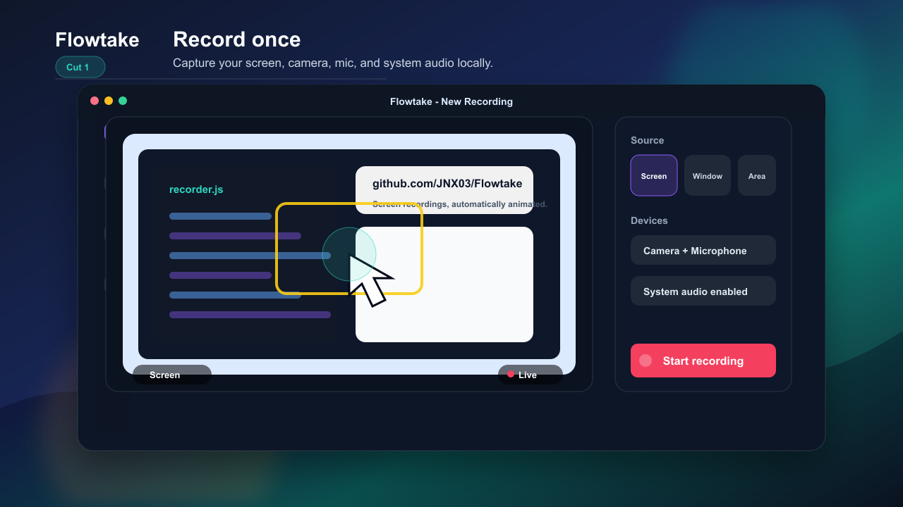
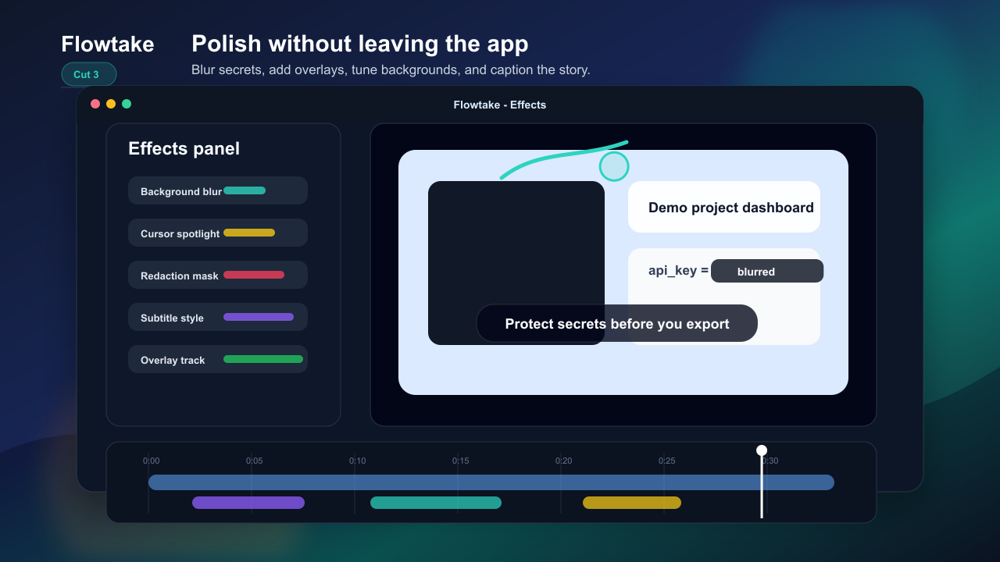

<p align="center">
  
</p>

<h3 align="center">Screen recordings, automatically animated.</h3>

<p align="center">
  A free, open-source desktop screen recorder that automatically adds cinematic zoom and pan animations to your recordings — like Screen Studio, but free, local, and cross-platform.
</p>

<p align="center">
  <a href="https://github.com/JNX03/Flowtake/releases/latest"></a>
  <a href="https://github.com/JNX03/Flowtake/releases"></a>
  <a href="https://github.com/JNX03/Flowtake/actions/workflows/ci.yml"></a>
  <a href="LICENSE"></a>
  
  
  
  
  
</p>

<p align="center">
  <a href="#download">Download</a> &bull;
  <a href="#features">Features</a> &bull;
  <a href="#why-flowtake">Why Flowtake?</a> &bull;
  <a href="#screenshots">Screenshots</a> &bull;
  <a href="#development">Development</a> &bull;
  <a href="CONTRIBUTING.md">Contributing</a>
</p>

---

<!-- DEMO GIF -->
<!-- TODO: Record with Flowtake itself, save to docs/demos/demo.gif, then uncomment below -->
<!-- <p align="center">
  
</p> -->

## Download

Get the latest stable release for your platform:

| Platform | Installer | Download |
|----------|-----------|----------|
| **Windows 10/11** (x64) | `.exe` / `.msi` / portable `.zip` | [Latest release](https://github.com/JNX03/Flowtake/releases/latest) |
| **macOS** (Universal) | `.dmg` / portable `.zip` | [Latest release](https://github.com/JNX03/Flowtake/releases/latest) |
| **Linux** (x64) | `.AppImage` / `.deb` / `.rpm` / portable `.tar.gz` | [Latest release](https://github.com/JNX03/Flowtake/releases/latest) |

> **Platform status** — Windows is stable and the primary daily-driver platform. macOS and Linux builds exist but are a developer preview — expect bugs. Stable support for all three is targeted for **v2.0**.

FFmpeg is bundled on Windows and macOS. On Linux, the `.deb` and `.rpm` packages declare `ffmpeg`, `xdotool`, and `wmctrl` as dependencies and your package manager will install them automatically.

Windows users can also install the published WinGet package:

```powershell
winget install --id JNX03.Flowtake --exact
```

Additional catalog-ready manifests and their validation status live in
[packaging/README.md](packaging/README.md).

## Why Flowtake?

| | Flowtake | Screen Studio | Loom | OBS Studio |
|---|---|---|---|---|
| **Auto-zoom animations** | ✓ | ✓ | ✗ | ✗ |
| **Free** | ✓ | ✗ ($229) | Partial (freemium) | ✓ |
| **Open source** | ✓ (MIT) | ✗ | ✗ | ✓ |
| **Runs locally (no cloud)** | ✓ | ✓ | ✗ | ✓ |
| **Cross-platform** | ✓ (Win/Mac/Linux) | macOS only | ✓ | ✓ |
| **Built-in editor** | ✓ | ✓ | ✓ | ✗ |
| **Cursor smoothing + blur** | ✓ | ✓ | ✗ | ✗ |
| **Teleprompter** | ✓ | ✗ | ✗ | ✗ |
| **Masks / redaction** | ✓ | Limited | ✗ | ✗ |
| **Native binary footprint** | ~80 MB (Tauri) | ~100 MB | Web / Electron | ~300 MB |

Flowtake gives you the polish of Screen Studio, the flexibility of OBS, and the zero-friction of Loom — all free, all local, all open source.

## Features

### Recording
- **Screen capture** — Record full screen, specific windows, or custom regions
- **Camera overlay** — Picture-in-picture with configurable layouts (side-by-side, overlay, camera-only)
- **System audio** — Capture system audio alongside microphone input
- **Multi-monitor** — Support for multi-display setups

### Auto-animation
- **Auto-zoom** — Intelligent zoom effects that follow your cursor and focus areas
- **Pan animations** — Smooth camera panning with velocity-based camera leading for natural follow
- **Cursor inertia & motion blur** — Adaptive velocity-based cursor smoothing with motion blur scaled by speed
- **Click indicators** — Animated visual feedback for mouse clicks
- **Custom cursors** — Replace or style cursor appearance in recordings

### Editing
- **Timeline editor** — Ctrl+mousewheel zoom with granular grid spacing
- **Clips & cuts** — Trim, split, and arrange video segments
- **Smooth playhead** — Refined playhead with larger drag handles and improved clip feedback
- **Undo/redo** — Full history support for all editing operations

### Effects & overlays
- **Overlay tracks** — Add images, shapes, and custom elements with animation
- **Audio tracks** — Import and mix multiple audio tracks
- **Subtitles & captions** — Built-in subtitle editor with on-device speech recognition
- **Masks & blur** — Redact sensitive areas with blur or solid masks
- **Backgrounds** — Custom backgrounds with wallpaper and blur effects
- **Intro/outro** — Configurable zoom transitions for start and end

### Productivity
- **Teleprompter** — Built-in teleprompter with speech recognition sync (unique to Flowtake)
- **Presets** — Save and load recording/editing presets
- **Asset library** — Predefined assets for quick overlay creation
- **Project system** — Save, load, and manage editing projects
- **Hotkeys** — Fully customizable keyboard shortcuts

### Export
- **FFmpeg encoding** — Professional-grade video encoding via bundled FFmpeg sidecar
- **Multiple formats** — Export to MP4, WebM, and more
- **Configurable quality** — Choose encoder, resolution, and bitrate settings

## Screenshots

<!-- TODO: Replace placeholders with real screenshots -->
<!-- Save to docs/screenshots/ and uncomment below -->
<!-- <p align="center">
  
  <br><em>The timeline editor — clips, effects, overlays, subtitles.</em>
</p>

<p align="center">
  
  <br><em>Native recorder with area picker and camera overlay.</em>
</p>

<p align="center">
  
  <br><em>Masks, blur, custom backgrounds, redaction.</em>
</p> -->

_Screenshots coming soon — see [docs/launch](docs/launch/) for marketing materials._

## Architecture

Flowtake is built with a modern hybrid architecture combining a Rust backend with a React frontend.

On macOS 13 and newer, recording first tries a small Swift
[ScreenCaptureKit](https://developer.apple.com/documentation/screencapturekit)
helper. It captures a real display, region, or window using NV12 frames and can
record system audio without a loopback driver. If the helper is unavailable or
cannot start, Flowtake keeps the existing FFmpeg/AVFoundation path as a runtime
fallback. macOS remains a developer preview until the signed and notarized build
passes the real-hardware checks in [ROADMAP.md](ROADMAP.md).

```
+------------------------------------------------------------------+
|                        Flowtake Application                       |
+------------------------------------------------------------------+
|                                                                    |
|   +---------------------------+   +----------------------------+   |
|   |      Tauri v2 (Rust)      |   |     React 19 Frontend      |   |
|   |---------------------------|   |----------------------------|   |
|   | - Recording control       |   | - Editor workspace         |   |
|   | - FFmpeg sidecar mgmt     |   | - Timeline (zoom, pan,     |   |
|   | - Window/area picking     |   |   clicks, clips, masks,    |   |
|   | - File I/O & projects     |   |   subtitles, overlays,     |   |
|   | - Mouse tracking          |   |   audio tracks)            |   |
|   | - System integration      |   | - Properties panel         |   |
|   | - Video streaming         |   | - Preview player (Pixi.js) |   |
|   |   (video:// protocol)     |   | - Settings & presets       |   |
|   | - Export pipeline          |   | - Asset library            |   |
|   +---------------------------+   +----------------------------+   |
|                |                               |                   |
|                +---------- IPC Bridge ---------+                   |
|                       (Tauri Commands)                             |
|                                                                    |
+------------------------------------------------------------------+
|  Redux Toolkit (State)  |  Pixi.js (Render)  |  FFmpeg (Encode)  |
+------------------------------------------------------------------+
```

### Multi-window design

| Window | Purpose |
|--------|---------|
| **Main** | Launcher + full video editor with timeline |
| **Recorder** | Recording overlay and controls |
| **Exporter** | Render progress and export settings |
| **Window Picker** | Interactive window selection for capture |
| **Area Picker** | Custom region selection tool |
| **Note** | Annotation window (excluded from capture) |

### Tech stack

| Layer | Technology |
|-------|-----------|
| **Desktop framework** | [Tauri v2](https://v2.tauri.app/) (Rust) |
| **Frontend** | [React 19](https://react.dev/) + [Redux Toolkit](https://redux-toolkit.js.org/) |
| **Styling** | [TailwindCSS 4](https://tailwindcss.com/) + [DaisyUI 5](https://daisyui.com/) |
| **Graphics** | [Pixi.js 8](https://pixijs.com/) (WebGL-accelerated 2D rendering) |
| **macOS capture** | Swift + [ScreenCaptureKit](https://developer.apple.com/documentation/screencapturekit) on macOS 13+, with FFmpeg fallback |
| **Video encoding** | VideoToolbox/AVAssetWriter for native macOS capture; [FFmpeg](https://ffmpeg.org/) for fallback, editing, and export |
| **Build tool** | [Vite 7](https://vite.dev/) |
| **AI / ML** | [MediaPipe](https://ai.google.dev/edge/mediapipe/solutions/guide) + [HuggingFace Transformers](https://huggingface.co/docs/transformers.js) (on-device) |

## Installation

### Download (recommended)

Grab the latest installer from the [Releases page](https://github.com/JNX03/Flowtake/releases/latest).

### System requirements

- **RAM**: 4 GB minimum, 8 GB recommended
- **Storage**: ~200 MB for installation
- **GPU**: Hardware acceleration recommended for smooth preview

## Development

### Prerequisites

- [Node.js](https://nodejs.org/) 20+
- [Rust](https://www.rust-lang.org/tools/install) (stable toolchain)
- [Tauri v2 CLI](https://v2.tauri.app/start/prerequisites/)
- [FFmpeg](https://ffmpeg.org/) binary in `resources/`
- macOS development: Xcode command-line tools with Swift 5.9+

### Setup

```bash
# Clone the repository
git clone https://github.com/JNX03/Flowtake.git
cd Flowtake

# Install frontend dependencies
npm install

# Run in development mode (starts Tauri + Vite dev server)
npm run dev
```

### Available scripts

| Command | Description |
|---------|-------------|
| `npm run dev` | Start Tauri dev server with hot reload |
| `npm run dev:frontend` | Start Vite frontend only (port 5173) |
| `npm run build` | Build production installer (NSIS/MSI) |
| `npm run build:frontend` | Build frontend assets only |
| `npm run build:macos-capture` | Build and verify the universal Swift capture helper (macOS only) |
| `npm run lint` | Run ESLint on the codebase |

### Project structure

```
Flowtake/
├── app/                     # React frontend
│   ├── shared/              # Code shared across all windows
│   │   ├── redux/           # Redux Toolkit store and slices
│   │   ├── scene/           # Pixi.js animation/rendering engine
│   │   ├── workers/         # Web Workers for preview and render
│   │   ├── tauriBridge.js   # IPC compatibility layer
│   │   ├── helpers.js       # Shared utility functions
│   │   └── constants.js     # App-wide constants
│   ├── components/          # Shared React UI components
│   └── windows/             # Per-window entry points
│       ├── main/            # Main editor window (100+ components)
│       ├── exporter/        # Export/render queue
│       ├── recorder/        # Recording overlay
│       ├── windowPicker/    # Window selection
│       ├── areaPicker/      # Area selection
│       └── note/            # Annotation window
│
├── src-tauri/               # Rust backend (Tauri v2)
│   ├── src/
│   │   ├── commands/        # IPC command handlers
│   │   ├── lib.rs           # App setup & video:// protocol
│   │   ├── state.rs         # Global application state
│   │   └── mouse_tracker.rs # System-wide mouse tracking
│   ├── Cargo.toml           # Rust dependencies
│   └── tauri.conf.json      # Tauri window & plugin config
│
├── resources/               # Bundled binaries (FFmpeg, AHK scripts)
├── docs/                    # Architecture and development docs
├── vite.config.mjs          # Vite build configuration
└── package.json             # NPM dependencies & scripts
```

For detailed documentation, see the [docs](docs/) directory or browse by topic:
- [Getting Started](docs/getting-started/installation.md)
- [Features Guide](docs/features/README.md)
- [Architecture](docs/architecture/README.md)
- [Development Setup](docs/getting-started/development.md)

## Contributing

Flowtake is actively developed and welcomes contributions — especially:

- **Wayland cursor tracking fixes** (the biggest open bug)
- **macOS polish and bug reports**
- **Translation / localization**
- **New auto-zoom tuning profiles**

Please read the [Contributing Guide](CONTRIBUTING.md) to get started.

Quick overview:
1. Fork the repository
2. Create a feature branch (`git checkout -b feature/your-feature`)
3. Commit your changes (`git commit -m 'feat: add your feature'`)
4. Push to your branch (`git push origin feature/your-feature`)
5. Open a Pull Request

Please also review the [Code of Conduct](CODE_OF_CONDUCT.md) before participating.

## Security

If you discover a security vulnerability, please follow the [Security Policy](SECURITY.md). Do **not** open a public issue for security vulnerabilities.

## Roadmap

See the evidence-gated [public roadmap](ROADMAP.md) for current, next, and later
work. In particular, macOS stable support is gated on real Apple Silicon and
Intel QA plus Developer ID signing and notarization.

## License

This project is licensed under the [MIT License](LICENSE).

## Press & media

For press inquiries, logos, screenshots, and product descriptions, see [PRESS.md](PRESS.md).

## Acknowledgments

- [Tauri](https://tauri.app/) — Desktop framework
- [React](https://react.dev/) — UI library
- [Pixi.js](https://pixijs.com/) — 2D rendering engine
- [FFmpeg](https://ffmpeg.org/) — Video encoding
- [TailwindCSS](https://tailwindcss.com/) & [DaisyUI](https://daisyui.com/) — Styling
- [Redux Toolkit](https://redux-toolkit.js.org/) — State management

---

<p align="center">
  Made with Rust, React, and a lot of screen recordings.
  <br>
  <sub>If Flowtake saves you time, a star on the repo means a lot.</sub>
</p>
